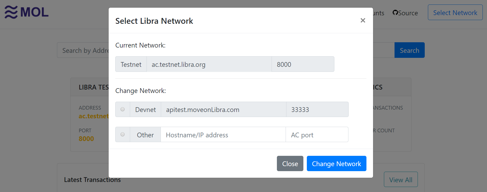
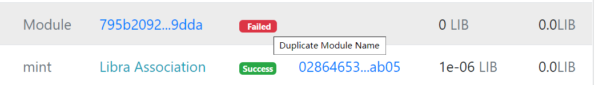
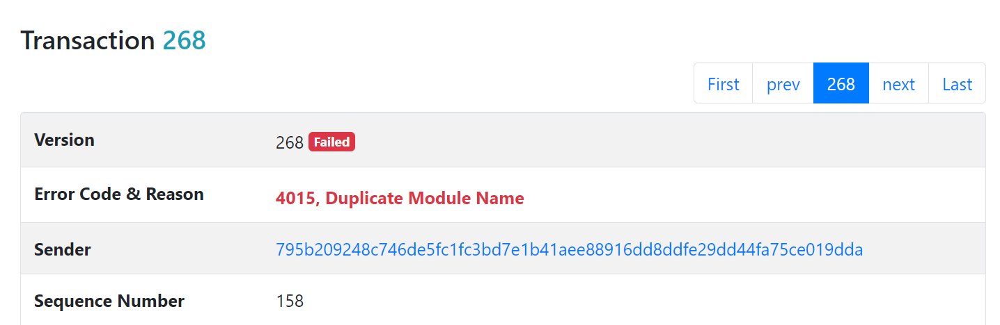

# MOL LibraExplorer   

An Explorer for the Libra Blockchain Netwrok powered by `MoveOnLibra` OpenAPI. The `MoveOnLibra` is an OpenAPI platform which make write Libra wallet and smart contract program easier.

## A Realtime Libra Blockchain Explorer
There are several Libra explorers there already. Why write another Libra Explorer? Because all other explorers there are not realtime. They pull data from Libra blockchian and save it to their own private database. When you access their explorer website, they search data from private database and return data to you.

On the other hand, `MOL LibraExplorer` fetch data from original Libra blockchain in realtime and return data to you. So, the data is more accurate and fresher. You can access the Libra blockchain data by visiting following website:

[explorer.moveonlibra.com](http://explorer.moveonlibra.com/) which is power by this opensource project.

It's fast and accurate.

## What's new

### Libra Network Select(2019-11-28)

"MOL LibraExplorer" support three  types of libra blockchain network:

* **Testnet**, comprised of test validator nodes running Libra Core, the software which maintains the Libra cryptocurrency.

* **Devnet**, a specail version of testnet maintained by MoveOnLibra instead of Libra Association, support publish and execute custom move modules and scripts.

* **Anonymous**, any third-party Libra network as long as the host and port of those network is publicly accessible.

The `Select Network` feature let's you select one of supported networks to explore.

### Show Error Message For Failed Transactions(2019-11-28)

Show Error Message In the Transaction List Page:

Show Error Code and Error Message In the Single Transaction Show Page:

## Feedback is welcome.

TODO: multi-language support
